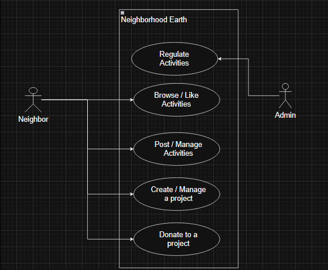

# Welcome to Terra Action Hub (Formerly known as Neighborhood Earth)👋

## Purpose of this project

**Climate change is accelerating faster than ever**. Human activities like energy use, industry, transportation, and agriculture are releasing greenhouse gases that have already warmed the planet by 1.2°C compared to pre-industrial times. This is driving intense droughts, rising sea levels, wildfires, floods, and biodiversity loss.

Scientists agree that to avoid the worst impacts, we must limit global warming to 1.5°C — yet current policies could lead us to as much as 3.1°C of warming by the end of the century.

Check out the official [United Nations Climate Change Article](https://www.un.org/en/climatechange/what-is-climate-change)

To meet this challenge, we need more than just policy — we need people-powered change.

Project Neighborhood Earth is a platform designed to:

- Let people share positive climate actions in their communities

- Promote events aimed at environmental impact

- Crowdfund eco-friendly ideas and projects, empowering everyday people to make a difference

By turning climate awareness into community action, we aim to grow a global neighborhood of change-makers — one good deed at a time.

## Key Functional Requirements for the MVP

- Search and post neighborhood activities (Snaps) by location
- Project creation (Eco Missions): Users can create, manage and display their projects with essential details and image in order to raise funds
- Payments: Users can browse and donate to a project an amount of their choosing
- User Authentication: Secure login and registration process for users

## Use Case Diagram

Below is a visual representation of how the user interacts with the system



## Get started

1. Install dependencies

   ```bash
   npm install
   ```

2. Start the app

   ```bash
   npx expo start
   ```

Download the app expo go on your mobile phone

In the output, you'll find a QR Code, scan it with your camera, the app should open.

## Get a fresh project
